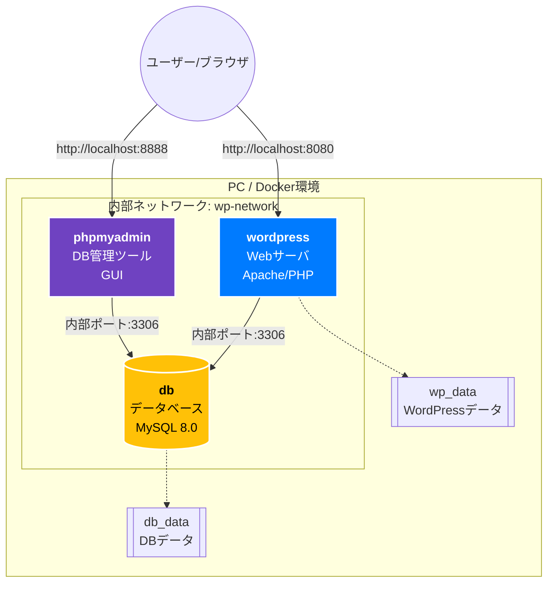

# 最終課題：Docker Compose を用いた発展的な Web サーバ構築手順書

**作成日:** 2025 年 12 月 11 日

---

## 目次

1. [課題概要](#1-課題概要)
2. [前提条件](#2-前提条件)
3. [全体構成図とポート設計](#3-全体構成図とポート設計)
4. [Docker 環境の導入](#4-docker環境の導入)
5. [事前準備](#5-事前準備)
6. [構築手順（再現手順）](#6-構築手順再現手順)
7. [動作確認と検証](#7-動作確認と検証)
8. [トラブルシューティング](#8-トラブルシューティング)
9. [参考文献](#9-参考文献)

---

## 1. 課題概要

本手順書では、Web サイト運用に必要な「[Web サーバ](reference/web-server.md)」と「[データベース](reference/database.md)」に加え、[データベース](reference/database.md)を GUI で管理できる「管理ツール」を含めた**3 [コンテナ](reference/container.md)構成**のサーバ環境を構築する。

### 1.1 目的と完成条件

- **目的:** [Docker Compose](reference/docker-compose.md) を使用し、コマンド 1 つで再現可能な [CMS](reference/cms.md)（WordPress）環境を構築する。
- **発展要素（追加機能）:**
  1.  **3 [コンテナ](reference/container.md)構成への拡張:** 教科書の基本構成に加え、**[phpMyAdmin](reference/phpmyadmin.md)** [コンテナ](reference/container.md)を追加し、ブラウザから[データベース](reference/database.md)管理を行えるようにする。
  2.  **セキュリティ強化:** パスワード等の機密情報をコードに直書きせず、**[環境変数](reference/env.md)ファイル（.env）** に分離して管理する。
- **完成条件:**
  - ブラウザで `http://localhost:8080` にアクセスし、WordPress の画面が表示されること。
  - ブラウザで `http://localhost:8888` にアクセスし、[phpMyAdmin](reference/phpmyadmin.md) の管理画面が表示されること。

---

## 2. 前提条件

本手順書は以下の環境での実行を前提とする。環境が異なる場合、コマンドや挙動が異なる可能性があるため注意すること。

> **Note: 実行環境スペック**
>
> - **OS:** Ubuntu 22.04 LTS (Windows Subsystem for Linux - [WSL2](reference/wsl2.md) 推奨)
> - **Docker:** version 24.0.x 以上
> - **[Docker Compose](reference/docker-compose.md):** version v2.x 以上
> - **ネットワーク:** インターネットに接続可能であること（[イメージ](reference/image.md)のダウンロードに使用）

---

## 3. 全体構成図とポート設計

### 3.1 [コンテナ](reference/container.md)構成図（[Mermaid](reference/mermaid.md)）

内部で専用のネットワーク（`wp-network`）を構築し、以下の 3 つの[コンテナ](reference/container.md)を連携させる。



### 3.2 サービス詳細一覧

| サービス名     | [イメージ](reference/image.md) | 役割                                  | 内部ポート | 公開ポート | 備考                             |
| :------------- | :----------------------------- | :------------------------------------ | :--------- | :--------- | :------------------------------- |
| **wordpress**  | `wordpress:latest`             | [Web サーバ](reference/web-server.md) | 80         | **8080**   | ブラウザからアクセス用           |
| **db**         | `mysql:8.0`                    | [データベース](reference/database.md) | 3306       | 公開なし   | 内部通信のみ（セキュリティ向上） |
| **phpmyadmin** | `phpmyadmin`                   | DB 管理ツール                         | 80         | **8888**   | **【発展要素】** DB 管理用 GUI   |

### 3.3 データ永続化

> **注意:** 本手順では `MySQL 8.0` を使用します。MySQL 8 系の動作や初期化の注意点は参考ページ（[MySQL 8.0 解説](reference/mysql8.md)）を参照してください。

[コンテナ](reference/container.md)を削除してもデータが消えないよう、以下の [Docker Volume](reference/volume.md) を設定する。

- `wp_data`: WordPress の投稿データや画像などを保存
- `db_data`: MySQL の[データベース](reference/database.md)ファイルを保存

---

## 4. Docker 環境の導入

初期状態の Ubuntu に Docker および Docker Compose をインストールする手順を示す。

### 必要なパッケージのインストールとリポジトリ追加

以下のコマンドを順に実行し、公式リポジトリから Docker をインストールする。

```bash
# 1. パッケージ一覧の更新と必須ツールのインストール
sudo apt-get update
sudo apt-get install -y ca-certificates curl gnupg

# 2. Docker公式GPGキーの保存場所を作成
sudo install -m 0755 -d /etc/apt/keyrings

# 3. GPGキーをダウンロードして保存
curl -fsSL https://download.docker.com/linux/ubuntu/gpg | sudo gpg --dearmor -o /etc/apt/keyrings/docker.gpg
sudo chmod a+r /etc/apt/keyrings/docker.gpg

# 4. リポジトリリストを作成
echo \
  "deb [arch=$(dpkg --print-architecture) signed-by=/etc/apt/keyrings/docker.gpg] https://download.docker.com/linux/ubuntu \
  $(. /etc/os-release && echo "$VERSION_CODENAME")" | \
  sudo tee /etc/apt/sources.list.d/docker.list > /dev/null

# 5. 再度更新してDocker本体とプラグインをインストール
sudo apt-get update
sudo apt-get install -y docker-ce docker-ce-cli containerd.io docker-buildx-plugin docker-compose-plugin
```

### 権限の設定（sudo なしで実行可能にする）

毎回 `sudo` を入力しなくて済むよう、現在のユーザーを `docker` グループに追加する。

```bash
sudo groupadd docker || true
sudo usermod -aG docker $USER
newgrp docker
```

### インストール確認

以下のコマンドを実行し、バージョンが表示されれば導入完了である。

```bash
docker compose version
# 出力例: Docker Compose version v2.xx.x
```

## 5. 事前準備

ターミナル（Ubuntu）を開き、以下の手順で作業環境を準備する。

### 5.1 作業用ディレクトリの作成

ホームディレクトリ配下にプロジェクト用のフォルダを作成し、移動する。

```bash
mkdir -p ~/my-wordpress
cd ~/my-wordpress
```

### 5.2 構築前の確認

ディレクトリ内に余計なファイルがないことを確認する。

```bash
ls -l
# total 0 と表示されればOK
```

### 5.3 最終的なファイル構成予定

本手順を終えると、以下のようなファイル構成になる。

```text
~/my-wordpress/
├── .env                 # 【重要】パスワード等を記述する環境変数ファイル
└── docker-compose.yml   # コンテナの構成定義ファイル
```

---

## 6. 構築手順（再現手順）

本章のコマンドを上から順に実行することで、サーバ環境を構築する。

### 6.1 [環境変数](reference/env.md)ファイル (.env) の作成

**【セキュリティ配慮】**
パスワードなどの機密情報は `docker-compose.yml` に直接記述せず、別ファイルの `.env`（[環境変数](reference/env.md)ファイル）で管理する。これにより、設定ファイルを共有してもパスワードが漏洩するリスクを防ぐ。

以下のコマンドをコピー＆ペーストして実行し、ファイルを作成する。

```bash
cat <<EOF > .env
MYSQL_ROOT_PASSWORD=somewordpress
MYSQL_USER=wp_user
MYSQL_PASSWORD=wordpress_password
MYSQL_DATABASE=wordpress
EOF
```

（ヒアドキュメントの使い方の詳細は [heredoc の解説](reference/heredoc.md) を参照してください）

### 6.2 構成定義ファイル (docker-compose.yml) の作成

**【発展要素の実装】**
ここでは `phpmyadmin` サービスを追加定義している。
以下のコマンドをコピー＆ペーストして実行し、ファイルを作成する。

```yaml
cat <<EOF > docker-compose.yml
version: '3.8'

services:
  # 1. データベース (MySQL)
  db:
    image: mysql:8.0
    container_name: wp-db
    restart: always
    environment:
      # .envファイルから変数を読み込む
      MYSQL_ROOT_PASSWORD: \${MYSQL_ROOT_PASSWORD}
      MYSQL_DATABASE: \${MYSQL_DATABASE}
      MYSQL_USER: \${MYSQL_USER}
      MYSQL_PASSWORD: \${MYSQL_PASSWORD}
    volumes:
      - db_data:/var/lib/mysql
    networks:
      - wp-network

  # 2. Webサーバー (WordPress)
  wordpress:
    image: wordpress:latest
    container_name: wp-web
    restart: always
    depends_on:
      - db
    ports:
      - "8080:80"
    environment:
      WORDPRESS_DB_HOST: db
      WORDPRESS_DB_USER: \${MYSQL_USER}
      WORDPRESS_DB_PASSWORD: \${MYSQL_PASSWORD}
      WORDPRESS_DB_NAME: \${MYSQL_DATABASE}
    volumes:
      - wp_data:/var/www/html
    networks:
      - wp-network

  # 3. 発展要素: DB管理ツール (phpMyAdmin)
  phpmyadmin:
    image: phpmyadmin/phpmyadmin
    container_name: wp-pma
    restart: always
    depends_on:
      - db
    ports:
      - "8888:80"
    environment:
      PMA_HOST: db
      PMA_USER: \${MYSQL_USER}
      PMA_PASSWORD: \${MYSQL_PASSWORD}
    networks:
      - wp-network

volumes:
  db_data:
  wp_data:

networks:
  wp-network:
EOF
```

### 6.3 設定ファイルの確認

正しくファイルが作成されたか確認する。

```bash
ls -a
```

> **確認ポイント:** `.env` と `docker-compose.yml` の 2 つのファイルが存在していれば成功。
>
> 
>
> _図 1: 設定ファイル配置確認_

### 6.4 サービスの起動

バックグラウンドモード（`-d`）で[コンテナ](reference/container.md)を一括起動する。

```bash
docker compose up -d
```

---

## 7. 動作確認と検証

### 7.1 [コンテナ](reference/container.md)稼働状況の確認

3 つの[コンテナ](reference/container.md)すべてが `Up` または `Running` 状態であることを確認する。

```bash
docker compose ps
```

>  _図 2: 3 つの[コンテナ](reference/container.md)(wp-web, wp-db, wp-pma)の起動確認_

### 7.2 [Web サーバ](reference/web-server.md) (WordPress) の動作確認

ブラウザで以下の URL にアクセスし、WordPress の初期画面（言語選択など）が表示されることを確認する。

- **URL:** `http://localhost:8080`

>  _図 3: WordPress インストール画面へのアクセス成功_

### 7.3 【発展要素】[phpMyAdmin](reference/phpmyadmin.md) の動作確認

追加した管理ツールが動作し、[データベース](reference/database.md)と連携できているかを確認する。

- **URL:** `http://localhost:8888`
- **ログイン:** `.env` で設定したユーザー名(`wp_user`)とパスワード(`wordpress_password`)を入力する。

>  _図 4: [phpMyAdmin](reference/phpmyadmin.md) による DB 管理画面。左側に「wordpress」DB が自動作成されている。_

### 7.4 ログの確認

システムログを確認し、エラーが出ていないか、[データベース](reference/database.md)の初期化が正常に行われたかを確認する。

```bash
docker compose logs --tail 20
```

>  _図 5: ログ確認。「ready for connections」等のメッセージにより正常動作を確認。_

---

## 8. トラブルシューティング

### よくあるエラーと対処法

1.  **[ポート競合エラー](reference/port-bind.md) (Bind for 0.0.0.0:8080 failed)**
    - **原因:** すでに他のプロセスが 8080 番ポートを使用している。
    - **対処:** `docker-compose.yml` の `ports` 設定を `"8081:80"` などに変更して再起動する。
2.  **[データベース](reference/database.md)接続エラー (Error establishing a database connection)**
    - **原因:** MySQL の起動完了前に WordPress が接続しようとした（起動タイミングのズレ）。
    - **対処:** 数秒〜1 分ほど待ってからブラウザをリロードする。自動的に再接続される。

---

## 9. 参考文献

- [Docker Hub Official Image (WordPress)](https://hub.docker.com/_/wordpress)
- [Docker Hub Official Image (MySQL)](https://hub.docker.com/_/mysql)
- [Docker Hub Official Image (phpMyAdmin)](https://hub.docker.com/r/phpmyadmin/phpmyadmin)

---

**補足：用語解説リンク（reference 内）**

- [WSL2](reference/wsl2.md) — Windows Subsystem for Linux 2 の概要と運用上の注意
- [Docker](reference/docker.md) — Docker の基本概念と実務ポイント
- [Mermaid](reference/mermaid.md) — 手順書で使用している図記法の解説
- [Apache / PHP](reference/apache-php.md) — Web サーバと PHP の役割
- [MySQL 8.0](reference/mysql8.md) — MySQL 8 系の特徴と初期化の注意
- [Heredoc](reference/heredoc.md) — ヒアドキュメントの使い方と注意点
- [Docker Compose](reference/docker-compose.md) — Compose の概要と基本コマンド
- [Compose 主要キー](reference/docker-compose-keys.md) — `ports`/`volumes`/`depends_on` 等の解説
- [ポート競合（Bind エラー）](reference/port-bind.md) — ポートが取れない時の確認と対処
- [Web サーバ](reference/web-server.md) — サーバの役割と運用ポイント
- [Volume](reference/volume.md) — データ永続化の扱い
- [phpMyAdmin](reference/phpmyadmin.md) — DB 管理 GUI の使い方と注意
- [Image](reference/image.md) — イメージ管理とタグ運用
- [Env (.env)](reference/env.md) — 環境変数ファイルの管理
- [Database](reference/database.md) — データベース運用の基本
- [Container](reference/container.md) — コンテナの概念と実務注意
- [CMS](reference/cms.md) — WordPress 等の CMS の運用留意点
