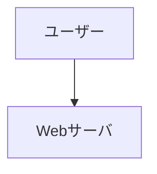

# Mermaid

[← 手順書に戻る](../README.md)

**概要:**
Mermaid はテキスト記述から図を生成するライブラリで、フローチャートやシーケンス図を Markdown に埋め込んで表示できます。手順書や README に図を手早く追加するのに便利です。

**主なポイント:**

- テキストで図を記述できるため差分管理しやすい。
- GitHub や VS Code で一部レンダリング対応。
- 大きな図は分割や `subgraph` を活用すると可読性向上。

**実務上の注意:**

- 表示されない環境もあるため PNG 等の併用を検討。
- Mermaid のレンダラーに依存する表現差異に注意。

**例:**

**参考:** Mermaid 公式ドキュメント

